# Mictract

**Markdown是一个基于hyperledger fabirc的BAAS（Blockchain As A Service)原型平台**

> BaaS的服务性体现在：工具性更强，便于创建、部署、运行和监控区块链。开发人员只需通过 API 和 SDK 等接口，连接这些功能，降低中小企业使用区块链的门槛。 BaaS 可使开发人员专注于业务应用层面的开发，无需专门建设自己的基础设施，服务购买即可，不仅可节省服务端研发成本，还可提供更好的测试工具，降低部署和测试成本。 可根据开发者的产品和业务特点，提供不同的在线配置和代码功能，扩展开发者自定义的功能，满足个性化需求，提高灵活性。 用户借助 BaaS 供应商在行业内的影响力和经验，可提升自身系统性的安全性。

我们希望通过此平台降低新工具的学习使用成本,利用传统的工具解决智能合约的部署效率与监控问题，同时此平台是在智能合约微服务化框架的基础上结合 DevOps 工具构建的，能够实现智能合约的持续部署与持续监控,帮助区块链技术工程师更快的部署智能合约、 构建区块链应用,降低新工具的使用成本,促进区块链技术普及化、区块链应用的落地和微服务领域向区块链领域的转型。

### Mictract的架构图
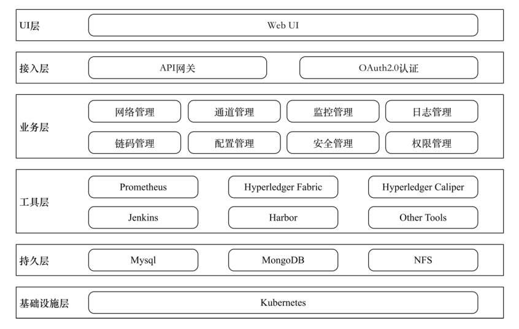

### Mictract使用的框架和技术

前端框架采用react，后端采用springboot+mybatis，其中也用到了hyperledger v2.0，3节点的Kubernetes集群，集群中其中一个节点也担任nfs服务器的作用，采用k8s-java api来进行后端和Kubernetes的连接。

### Mictract的主要功能
- 搭建网络：在Kubernetes集群中搭建符合用户需求的hyperledger fabric网络
- 通道管理: 在Kubernetes集群中指定fabric网络的指定节点间的通道进行相应的创建等操作
- 链码管理：在Kubernetes集群中指定fabric网络的指定通道进行链码的相应创建等操作
- 链码调用：在Kubernetes集群中指定fabric网络安装的链码进行调用
- 信息监控：对Kubernetes集群中指定fabric网络的区块信息，交易信息进行查询，对Kubernetes集群中指定fabric网络的容器进行性能监控
- 用户管理：对Kubernetes集群中指定fabric网络的组织用于进行管理等操作（待实现）

### Mictract的界面展示
- 主界面

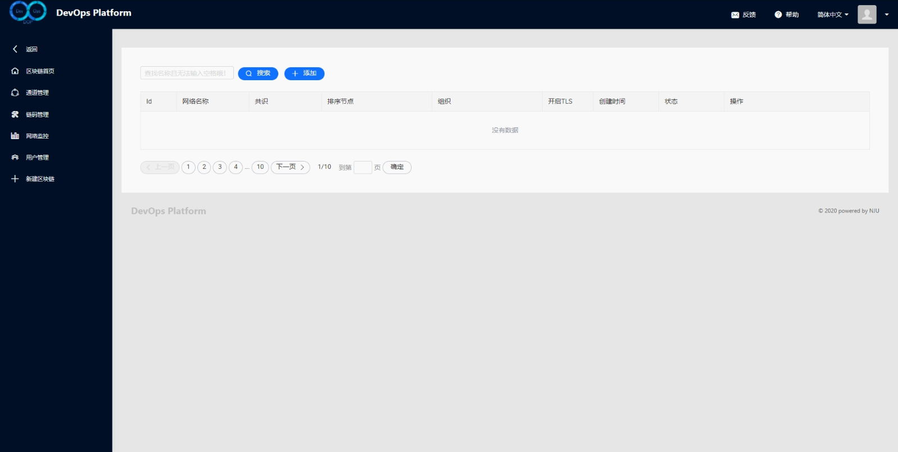

- 网络搭建

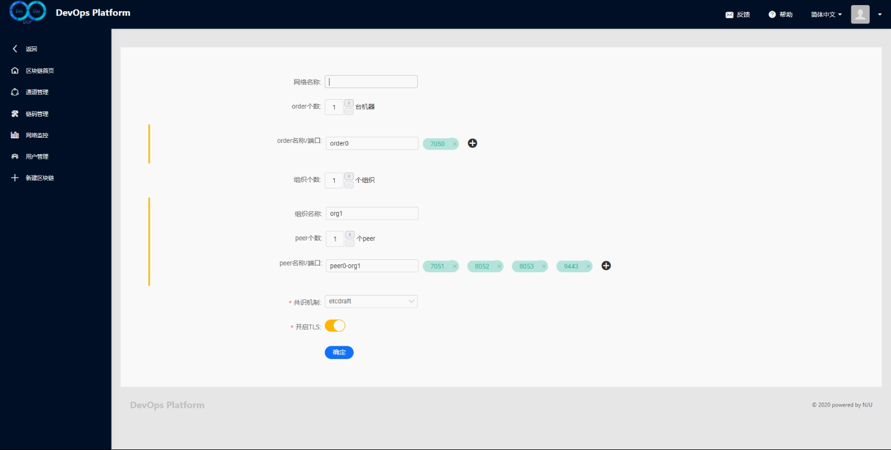

- 网络管理

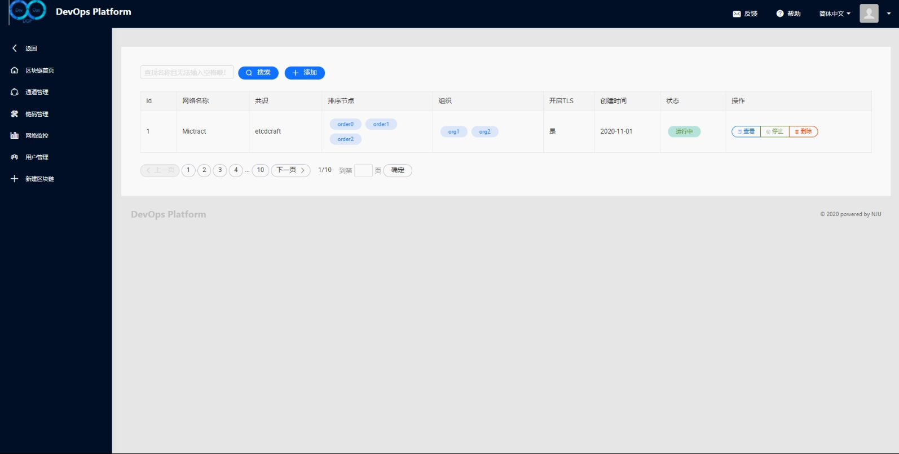

- 通道管理

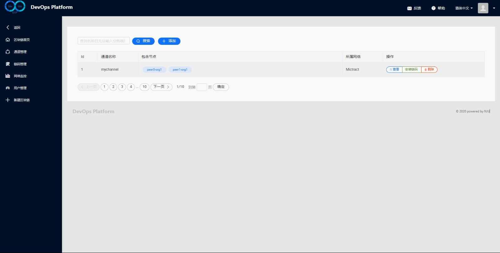

- 通道创建

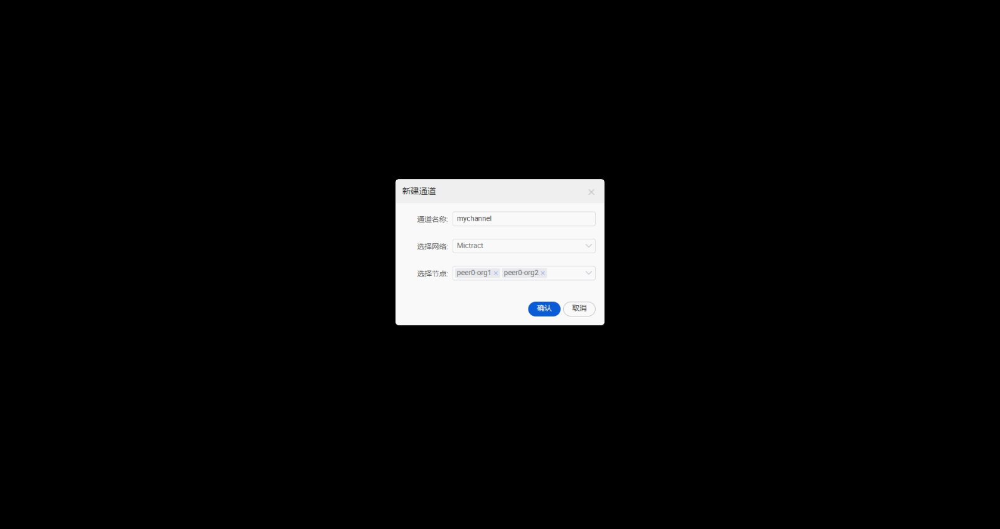

- 链码管理

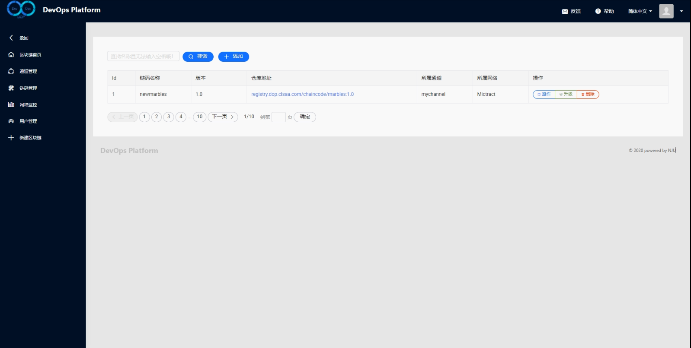

- 链码创建

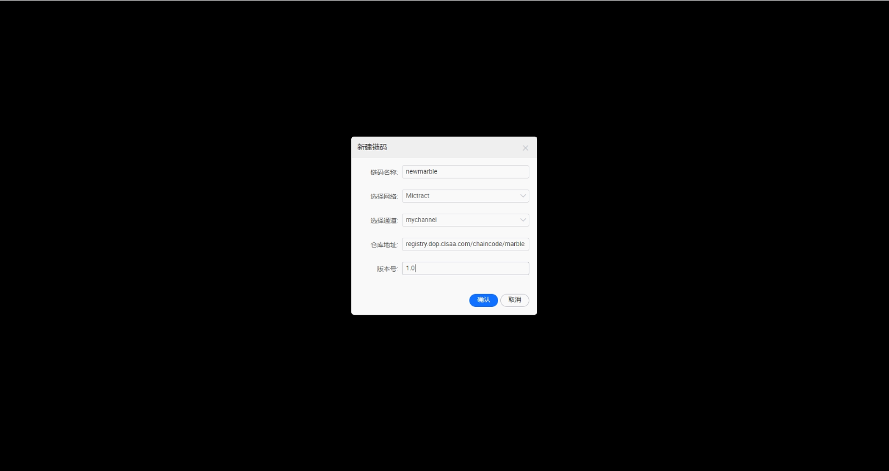

- 链码操作

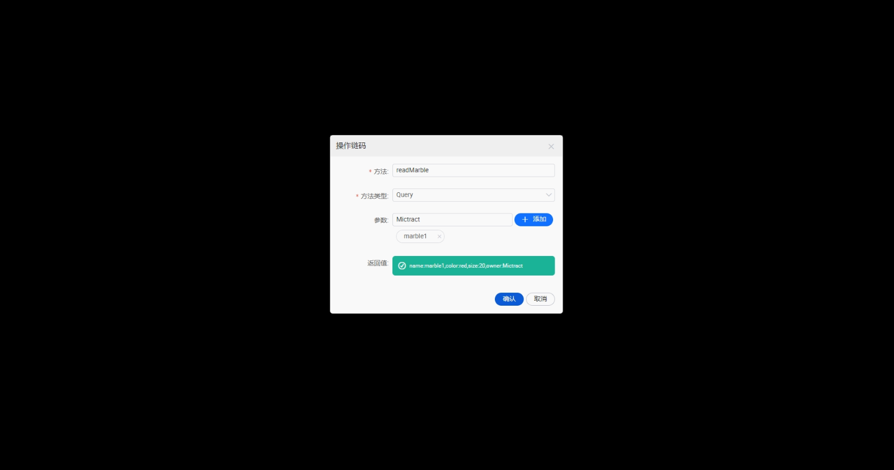

- 监控

1.容器信息

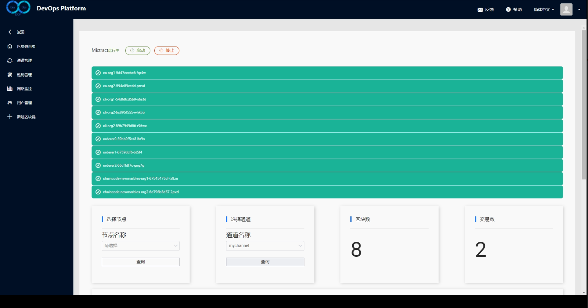

2.区块信息

3.交易信息

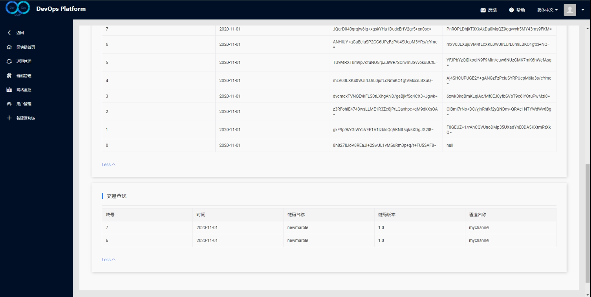

### Mictract部署网络所用时间

说明：根据网络节点的数量，org的数量以及通信效率的影响，同一规模的网络使用Mictract部署网络的时间可能会略有差别。

|手工部署时间| Mictract所用时间        | peer数量   |  orderer数量  | org数量|
| --------   | -----:  | -----:  | :----:  |:----:  |
|5分42秒| 2分16秒      | 2   |   2     |   2     |
|7分20秒| 3分05秒      | 4   |   3     |   2     |
|5分58秒| 2分36秒       |   2   |   3   |   2     |
|8分03秒| 3分22秒        |    3    |  4  |  3     |
|5分06秒| 2分12秒        |    1    |  2  |  1     |
|| 2分40秒        |    2    |  3  |  2     |
|| 3分11秒        |    4   |  3  |  2     |
|| 2分50秒        |    2    |  3  |  2     |
|| 2分29秒        |    2    |  3  |  1     |
|| 2分25秒        |    2    |  3  |  2     |
|| 3分16秒        |    3    |  4  |  3    |
